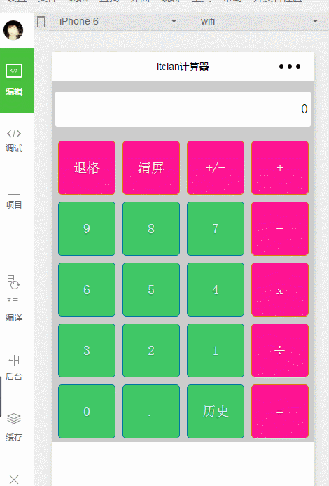

### 简计算器Demo实现

* 实现效果图


* 功能：简易加减乘除,对操做过的数进行记录
* 实现计算器功能,可以查看历史的计算记录
* 涉及内容:开发工具使用,页面布局,页面尺寸,样式定义,组件使用,时间绑定,数据绑定,数据更新,条件渲染,页面跳转,逻辑处理

### 具体实现过程

```
1.bindtap:绑定事件，内置的一个函数,相当onclick,后面是一个函数名
2.事件点击后面的函数在cal.js里面写
3. 点按键的时候,希望对应的是哪一个，如何知道它点击的是谁呢，可以给每一个唯一的标识
4:function中传递一个参数event
5:实现data数据绑定，用变量的方式，让页面也能得到
6:data:页面上可以读取的区域，变量名和值，页面上双大括号写上变量名,把js中的data下的变量名给读取出去了的
7. 给每一个id单独的值，数字健和加减乘除,用值来代替，点的时候，就可以用来显示了,这样是一种比较偷懒的写法
8.点击按钮,对应的显示,到对应的内容区域上,涉及到数据渲染，传统的web开发,比如说用Jquery得到view,用js的innerHTML或者text,而在小程序中不是这样的,是利用绑定数据，更改数据，页面也会跟着改变
9:点击的时候，数据对应的发生变化,怎么操作数据的问题了的，用到setData方法，注意js里面的this指的是Page 语法规则:this.setData({变量名:event.target.id});
10:字符串的拼接，处理第一个为0
11:退格处理，清屏,正负号，连续操作符不恩能够出现
12:处理等号问题，不能使用eval,微信里面不能使用这个方法
13:数组arr，实现加减乘除
14:历史操作，新的界面
15:在list里面的js里面写history方法,实现一个跳转,参考API文档,点击导航
16:数据储存,应用的存储呢,是与服务器进行打交道通讯,还有一种是利用H5的本地存储
17:先存储数据,在读数据
18:setStorageSync("key",value);key是自己命名的
19:在onload的时候,把历史值给存储起来
20:页面上如何显示出来,用到微信的一个循环，wx:for ={{logs}} 单个的item wx:for-item="名字"，不指定的话那么默认是Item,数据的存储
```
### wxml

```
<view class="content">
       <view class="screen">
            {{screenData}}
       </view>
       <view class="btnGroup">
                <view class="item pink" bindtap="clickButton" id="{{id1}}">退格</view>
                <view class="item pink" bindtap="clickButton" id="{{id2}}">清屏</view>
                <view class="item pink" bindtap="clickButton" id="{{id3}}">+/-</view>
                <view class="item pink" bindtap="clickButton" id="{{id4}}">+</view>
       </view>
       <view class="btnGroup">
                <view class="item blue" bindtap="clickButton" id="{{id5}}">9</view>
                <view class="item blue" bindtap="clickButton" id="{{id6}}">8</view>
                <view class="item blue" bindtap="clickButton" id="{{id7}}">7</view>
                <view class="item pink" bindtap="clickButton" id="{{id8}}">-</view>  
       </view>
       <view class="btnGroup">
                <view class="item blue" bindtap="clickButton" id="{{id9}}">6</view>
                <view class="item blue" bindtap="clickButton" id="{{id10}}">5</view>
                <view class="item blue" bindtap="clickButton" id="{{id11}}">4</view>
                <view class="item pink" bindtap="clickButton" id="{{id12}}">x</view>  
       </view>
       <view class="btnGroup">
                <view class="item blue" bindtap="clickButton" id="{{id13}}">3</view>
                <view class="item blue" bindtap="clickButton" id="{{id14}}">2</view>
                <view class="item blue" bindtap="clickButton" id="{{id15}}">1</view>
                <view class="item pink" bindtap="clickButton" id="{{id16}}">÷</view>  
       </view>
        <view class="btnGroup">
                <view class="item blue" bindtap="clickButton" id="{{id17}}">0</view>
                <view class="item blue" bindtap="clickButton" id="{{id18}}">.</view>
                <view class="item blue" bindtap="history" id="{{id19}}">历史</view>
                <view class="item pink" bindtap="clickButton" id="{{id20}}">=</view>  
       </view>
</view>
```

### wxss代码

```
/* pages/cal/cal.wxss */
.content{
    height:100%;
    display:flex;
    flex-direction:column; /*纵向的*/
    align-items:center;
    box-sizing:border-box;
    padding-top:30rpx;
    background:#ccc;
    
}
.screen{
    background:#fff;
    border-radius:3px;
    text-align:right;
    width:720rpx;
    height:100rpx;
    line-height:100rpx;
    padding-right:10rpx;
    margin-bottom:30rpx;
}
.btnGroup{
    display:flex;
    flex-direction:row;
} 
.item{
    width:160rpx;
    min-height:150rpx;
    margin:10rpx;
    text-shadow:0 1px 1px rgba(0,0,0,0.3);
    border-radius:5px;
    text-align:center;
    line-height:150rpx;
}
.pink{
    color:#fef4e9;
    border:solid 1px #da7c0c;
    background:deeppink;
}
.blue{
    color:#d9eef7;
    border:solid 1px #0076a3;
    background:#40C766;
}
```

