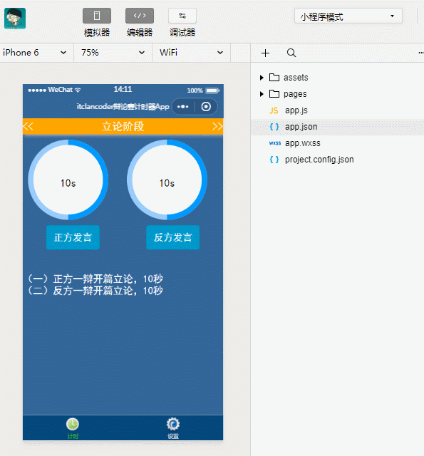

### 辩论赛计时APP

实现辩论赛计时器功能,可以设置不同阶段是否启用,时间限制以及提前多少秒语音提示等

* 涉及内容:动画实现,音频播放Audio,action-sheet,数据缓存

* tabBar,面向对象编程,js定时器,表单相关组件form,radio-group,slider,switch,button,text,view

### 实现效果

### 流程

辩论赛流程

立论阶段

1. 正方-辩开篇立论,3分钟
2. 反方-辩开篇立论,3分钟

驳立论阶段

1. 反方二辩驳对象立论,2分钟
2. 正方二辩驳对象立论,2分钟

质辩环节

1. 正方三辩提问反方一,二,四辩各一个问题,反方辩手分别应答,三个问题累计回答时间为1分30秒
2. 反方三辩提问正方一,二,四辩各一个问题,正方辩手分别应答,三个问题累计回答时间为1分30秒

自由辩论

1. 自由辩论 4分钟

总结陈词

1. 反方四辩总结陈词,3分钟
2. 正方四辩总结陈词,3分钟

### 具体代码见实例中所示

* assets:资源目录(图片及音乐)
* pages
  * index:计时组件页面
  * config:设置组件页面

