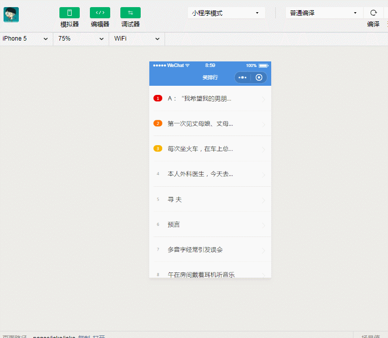

### 微信小程序笑排行

### 最终实现效果

* 上拉下拉动态加载
* 点击条目进入子页面,点击返回进入父页面
* 实现效果如下:


项目结构:
img:存储本地图片
pages:页面

    joke:笑排行主页面

    textJoke:子页面
utils:

    config.js:数据源

全局配置选项：app.json 

### 数据接口来源

[易源接口](https://www.showapi.com/)
数据接口config.js 
```
var appid = 66747;
var secret = "269a63df181d4a4088fcd85d429ffbd2";
var param = "?showapi_appid=" + appid +"&showapi_sign="+secret;

var textJoke = "https://route.showapi.com/341-1"+param;
var imgJoke = " https://route.showapi.com/341-2"+param;
var gifJoke = "https://route.showapi.com/341-3"+param;

module.exports = {
  textJoke: textJoke,
  imgJoke: imgJoke,
  gifJoke: gifJoke

}
```

笑排行主页业务代码:joke.js
```
// pages/joke/joke.js
var url = require('../../utils/config.js');  // 引入js
//var pageNum = 1;  // 初始化页数，每次改变时都要修改setData的值
console.log(url);
Page({

  /**
   * 页面的初始数据
   */
  data: {
      flag:false,
      loadingMore:false,
      loadingOver:false,
      data:[],
      color:['one','two','three'],
      pageNum:1,      // 页数定义在里面
  },
  /**
   * 生命周期函数--监听页面加载
   */
  onLoad: function (options) {
       wx.showLoading({
          title:'正在加载'
       })
       this.request();
  },
  request: function () {
      var self = this;
      var time = new Date().getTime();

       wx.request({
           url:url.textJoke,
          data:{
            showapi_timestamp:time,
            // page:this.data.pageNum,
           // page: pageNum,   // 在全局范围外定义了
           page:this.data.pageNum,
            maxResult:40
          },
           success:function(e){
                console.log(e);

                var data = e.data.showapi_res_body.contentlist;
                var length =  data.length;  // 获得数据的长度

                if(length == 0){
                    self.setData({
                         loadingMore:false,
                         loadingOver:true
                    });
                    return;
                }


                var list =  self.data.data.concat(data); 

                for(var i = 0;i<data.length;i++){
                    data[i].text =  self.removeHtml(data[i].text);
                }
                self.setData({                                                         /*data:e.data.showapi_res_body.contentlist,*/
                    //data:data,
                    data:list,
                    flag:true,
                    loadingMore:false   // 在加载完成后,把加载更多关闭掉
                });

                wx.hideLoading();  // 拿到数据后隐藏
                //pageNum++;
           }
       })
  },
  /** 跳转函数 */
  jump:function(e){
      console.log(e);
      var id = e.currentTarget.id;
      console.log(id);
      var temp =  JSON.stringify(this.data.data[id]);   // 需要进行序列化格式一下
      console.log(temp.title);
       wx.navigateTo({
           url:'../textJoke/textJoke?data='+temp,
       })
  },

  removeHtml:function(str){
       return str.replace(/<[^]+>/g,'');
  },
  /**
   * 生命周期函数--监听页面初次渲染完成
   */
  onReady: function () {
  
  },

  /**
   * 生命周期函数--监听页面显示
   */
  onShow: function () {
  
  },

  /**
   * 生命周期函数--监听页面隐藏
   */
  onHide: function () {
  
  },

  /**
   * 生命周期函数--监听页面卸载
   */
  onUnload: function () {
  
  },

  /**
   * 页面相关事件处理函数--监听用户下拉动作
   */
  onPullDownRefresh: function () {
        wx.showToast({
            title:'fsdfs',
        })
        this.request();
  },

  /**
   * 页面上拉触底事件的处理函数
   */
  onReachBottom: function () {
         wx.showToast({
              title:'触底了'
         });
         this.setData({
             loadingMore:true,  // 两种状态,其中之一
             loadingOver:false,
             pageNum:this.data.pageNum+1,
         })
        // pageNum++;   // 出发下拉的时候,加载数据
         this.request();

  },

  /**
   * 用户点击右上角分享
   */
  onShareAppMessage: function () {
  
  }
})
```
子页面数据
```
// pages/textJoke/textJoke.js
Page({

  /**
   * 页面的初始数据
   */
  data: {
      data:{}
  },

  /**
   * 生命周期函数--监听页面加载
   */
  onLoad: function (options) {
      console.log(options);
      var data =  JSON.parse(options.data);
      data.ct = data.ct.substr(0,10);
      console.log(data);
      this.setData({
          data:data
      })
  },

  /**
   * 生命周期函数--监听页面初次渲染完成
   */
  onReady: function () {
  
  },

  /**
   * 生命周期函数--监听页面显示
   */
  onShow: function () {
  
  },

  /**
   * 生命周期函数--监听页面隐藏
   */
  onHide: function () {
  
  },

  /**
   * 生命周期函数--监听页面卸载
   */
  onUnload: function () {
  
  },

  /**
   * 页面相关事件处理函数--监听用户下拉动作
   */
  onPullDownRefresh: function () {
  
  },

  /**
   * 页面上拉触底事件的处理函数
   */
  onReachBottom: function () {
  
  },

  /**
   * 用户点击右上角分享
   */
  onShareAppMessage: function () {
  
  }
})
```
其中列表数据是通过wx:for循坏出来的
joke的wxml代码
```
<!--pages/joke/joke.wxml-->
<view bindtap="jump"  id="{{index}}"  class="ul" hidden="{{!flag}}" wx:for="{{data}}" wx:key="u">
         <view class="li">
              <view class="left  {{color[index]}}">{{index+1}}</view>
              <view class="center">{{item.title}}</view>
              <view class="right">
                       <image src="../../img/alt.png"></image>
              </view>
         </view>
</view>

<!-- 当有数据的时候,显示加载这个 -->
<view  class="loading"  hidden='{{!loadingMore}}'>正在加载更多</view>
<!-- 当无数据时,显示加载完成 -->
<view class="loading"  hidden='{{!loadingOver}}'>已加载全部</view>

```
而textJoke的wxml代码
```
<!--pages/textJoke/textJoke.wxml-->
<view class="content">
        <view class="title">{{data.title}}</view>
        <view class="text">{{data.text}}</view>
        <view class="time">{{data.ct}}</view>
</view>

```


